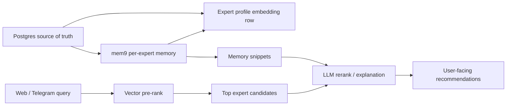

# Agent Memory and Search Stack

**Status**: Accepted (phased)
**Date**: 2026-05
**Scope**: How Help & Grow composes Postgres, pgvector, mem9, Zilliz, and DB9 for expert matching and the long-term "service as agent" direction.

This design turns the Zilliz / DB9 / mem9 research into product architecture. The principle is Lego blocks, not overlapping databases: each block owns one layer and can be swapped behind an interface.

---

## 1. Decision Summary

| Layer | Current default | Later option | Owns |
|-------|-----------------|--------------|------|
| Marketplace source of truth | Postgres (`DATABASE_URL`, Supabase now, Cloud SQL planned) | None | Users, experts, bookings, payments, system config |
| Expert semantic pre-rank | Postgres pgvector (`expert_profile_embeddings`) | Zilliz Cloud / Milvus | Fast top-K candidate retrieval |
| Long-term expert memory | mem9 hosted API (`v1alpha2`) | Self-hosted mem9 or pgvector mirror | Durable expert facts, preferences, meetup outcomes, appreciations |
| Agent run workspace | Postgres / HiClaw tables | DB9 for experiments and branches | Agent traces, reports, files, eval runs, temporary research DBs |

The production app keeps Postgres as the source of truth. mem9 is the product memory layer. pgvector is the current vector index because it is simple and already deployed. Zilliz becomes valuable once vector volume, multimodal retrieval, or recall tuning exceeds what pgvector should own. DB9 is useful first for internal agent workspaces, not for core marketplace data.

---

## 2. Runtime Flow



The fast path should stay:

1. Normalize the query cheaply.
2. Embed the query once.
3. Retrieve a small candidate set from the vector index.
4. Return deterministic recommendations for first-turn discovery, or use the LLM only when the conversation needs richer reasoning.

The memory path should stay:

1. Store stable expert facts and events into mem9.
2. Mirror to pgvector only when `USE_PGVECTOR_MEMORY=1`.
3. Refresh `expert_profile_embeddings` after meaningful memory writes, using Inngest/deferred work.
4. Never block booking, review, or onboarding responses on memory writes.

---

## 3. mem9 Contract

Hosted mem9 should be called through the current API shape:

- Provision a per-expert API key with `POST /v1alpha1/mem9s`.
- Store that key in `Expert.mem9SpaceId`.
- Use `v1alpha2` for daily operations:
  - `POST /v1alpha2/mem9s/memories`
  - `GET /v1alpha2/mem9s/memories`
  - `GET/PUT/DELETE /v1alpha2/mem9s/memories/{id}`
  - `POST /v1alpha2/mem9s/imports`
- Send the expert key as `X-API-Key`.
- Send `X-Mnemo-Agent-Id` for attribution, defaulting to `help-grow-platform`.
- Store Help & Grow context in `metadata`, including the legacy `source` value.

This keeps the existing per-expert isolation model while aligning the adapter with the hosted mem9 API. The old tenant-scoped `v1alpha1` memory routes should not be used for new operations.

---

## 4. Zilliz Boundary

Zilliz is not a source-of-truth database. It is a future vector-index provider behind an interface equivalent to:

```ts
interface VectorIndexProvider {
  upsertExpertProfile(input: ExpertProfileVector): Promise<void>;
  deleteExpertProfile(expertId: string): Promise<void>;
  rankExperts(query: string, options: RankOptions): Promise<string[]>;
}
```

Use Zilliz when at least one of these becomes true:

- `expert_profile_embeddings` reaches enough rows/chunks that pgvector tuning starts taking product time.
- We add multimodal retrieval for audio, video, documents, or social content.
- We need dedicated vector observability, migration tooling, backups, or managed recall tuning.
- Query p95 is dominated by vector search rather than embedding or LLM time.

Until then, pgvector remains the pragmatic default.

---

## 5. DB9 Boundary

DB9 should start as an agent workspace layer:

- HiClaw experiments and evaluator outputs.
- Codex/Cursor research runs.
- Temporary branch databases for schema/search experiments.
- RAG labs that combine files, SQL, cron, and built-in embeddings.

DB9 should not become the Web/Telegram production database in this phase. The production path remains standard Postgres because Prisma, Auth.js, payments, Vercel deploys, and the Cloud SQL migration are already built around it.

---

## 6. Implementation Priority

1. **mem9 adapter modernization** - move runtime memory operations to hosted `v1alpha2` with `X-API-Key` and `X-Mnemo-Agent-Id`, preserving existing lifecycle call sites.
2. **Memory governance** - add richer tags/metadata and review/delete/export surfaces before writing more sensitive memories.
3. **Vector provider interface** - keep pgvector as default, make the boundary explicit so Zilliz is a future provider, not a rewrite.
4. **DB9 pilot** - use DB9 for one internal HiClaw/Codex evaluation workspace, then decide whether it earns a permanent role.
5. **Zilliz pilot** - mirror expert profile embeddings to Zilliz only after pgvector shows real scale or multimodal limitations.

---

## 7. Verification

- `npm run typecheck`
- `npm run build`
- Live smoke after deploy:
  - `/api/v1/experts`
  - `/api/experts/match`
  - one onboarding publish or admin-triggered memory seed in an environment with `MEM9_ENABLED=1`
- Confirm logs show mem9 `v1alpha2` calls succeeding and no fallback to `v1alpha1` memory routes.

## 8. External References

- [mem9 hosted API reference](https://mem9.ai/api) - `v1alpha2`, `X-API-Key`, optional `X-Mnemo-Agent-Id`, memories, imports, and session routes.
- [Zilliz Cloud docs](https://docs.zilliz.com/) - managed Milvus vector database for the future vector-index provider boundary.
- [DB9](https://db9.ai/) - candidate internal agent workspace layer; not a production marketplace database in this phase.
