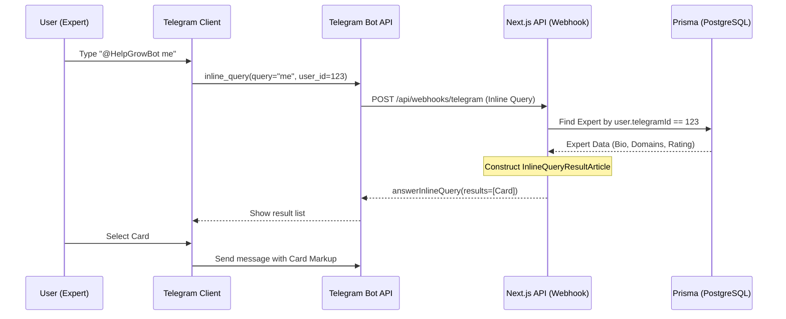

# System Design: Expert Profile Sharing (Telegram Card)

**Product Objective**: Enable experts to share a high-conversion "booking card" directly in any Telegram chat using a simple inline command.

---

## 1. User Journey

### Awareness & Onboarding
1. Expert navigates to their **Profile Dashboard** in the Help & Grow Mini App.
2. A new section **"Share to Telegram"** is displayed with their unique bot command: `@HelpGrowBot me`.

### Sharing Flow
1. Expert goes to a group chat (e.g., *SG AI Founders*).
2. Expert types `@HelpGrowBot me` in the message input.
3. A thumbnail appears above the input with their Profile Picture, Name, and Rating.
4. Expert taps the thumbnail.
5. A rich "Expert Card" is sent to the group.

### Interaction Flow
1. Peer sees the card in the group.
2. Peer taps **"🚀 View Profile"** or **"📅 Book Session"**.
3. Peer is taken directly to the expert's booking page inside the Mini App.

---

## 2. Technical Architecture

### Component Diagram (Mermaid)



---

## 3. Data Mapping & Schema

To generate the card, the Telegram Webhook will map existing Prisma fields to the `InlineQueryResultArticle` object.

| Prisma Field | Telegram Card Element | Description |
|---|---|---|
| `user.name` / `nickName` | **Title** | "Expert: [Name]" |
| `expert.bio` | **Description** | Snippet of the bio (max 100 chars) |
| `user.image` | **Thumbnail/Photo** | Expert avatar |
| `expert.avgRating` | **Text/Symbol** | Displayed as "⭐ [Rating] ([Count])" |
| `expert.id` | **URL / WebApp Button** | Deep link: `/experts/[id]` |

### Sample Payload (Draft)
```json
{
  "type": "article",
  "id": "expert_unique_id",
  "title": "Alex Chen — AI Strategy Expert",
  "description": "Ex-FAANG, based in Singapore. 4.9⭐ (42 reviews). Helping founders with regional scale.",
  "thumb_url": "https://expert-network.com/avatars/alex.jpg",
  "input_message_content": {
    "message_text": "*Alex Chen — AI Expert*\n\nEx-FAANG, based in Singapore.\n⭐ 4.9 (42 reviews)\n\n_Book a 30-min strategy session below_",
    "parse_mode": "Markdown"
  },
  "reply_markup": {
    "inline_keyboard": [[
      { "text": "🚀 Open Profile", "web_app": { "url": "https://hng.app/experts/alex123" } },
      { "text": "📅 Book Now", "web_app": { "url": "https://hng.app/experts/alex123/book" } }
    ]]
  }
}
```

---

## 4. Security & Authentication

1. **User Linking**: Since we already store `telegramId` in the `User` model, the webhook can immediately identify the requesting user from the `inline_query.from.id`.
2. **Rate Limiting**: Telegram handles query throttling, but our API should handle `answerInlineQuery` results with a short cache time (e.g., 300 seconds) to prevent redundant DB hits.

---

## 5. Success Metrics

- **Sharing Volume**: Number of unique experts using the `@me` command per week.
- **Viral Coefficient**: New user signups originating from a Telegram card share event.
- **Conversion**: Click-through rate from Telegram Expert Card to Booking Success.
